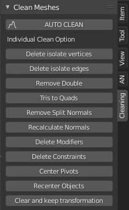

# Clean_meshes_Blender2.9
Clean complex and dirty meshes in blender 2.9

## Welcome! 👋

As for you have a factory object that to a very dirty topology.
In many large numbers you will not be able to clean them by hand.
This script is there for that.

You can buy it here: https://gumroad.com/products/KUMjG
Or you can take it for free on this github.

**Good day !** 🚀
